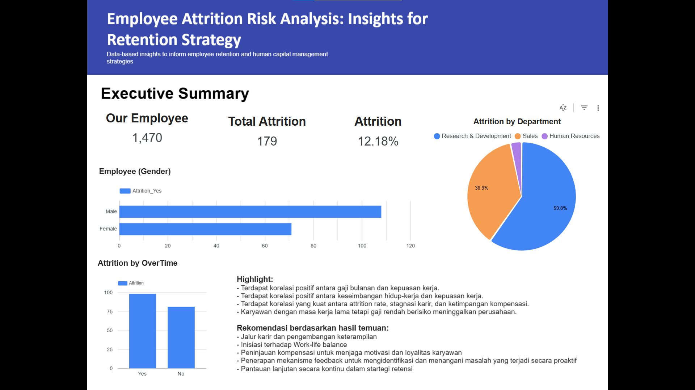
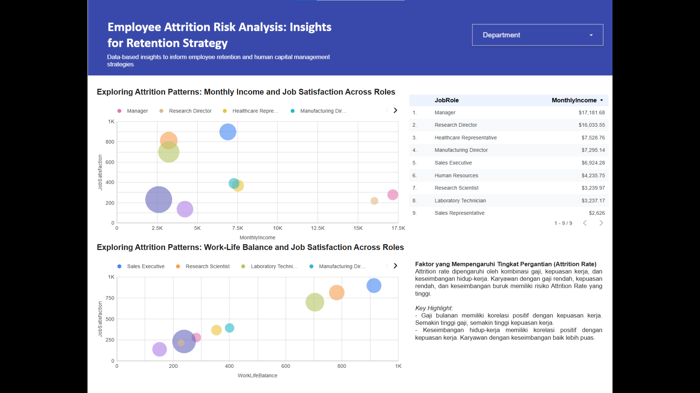
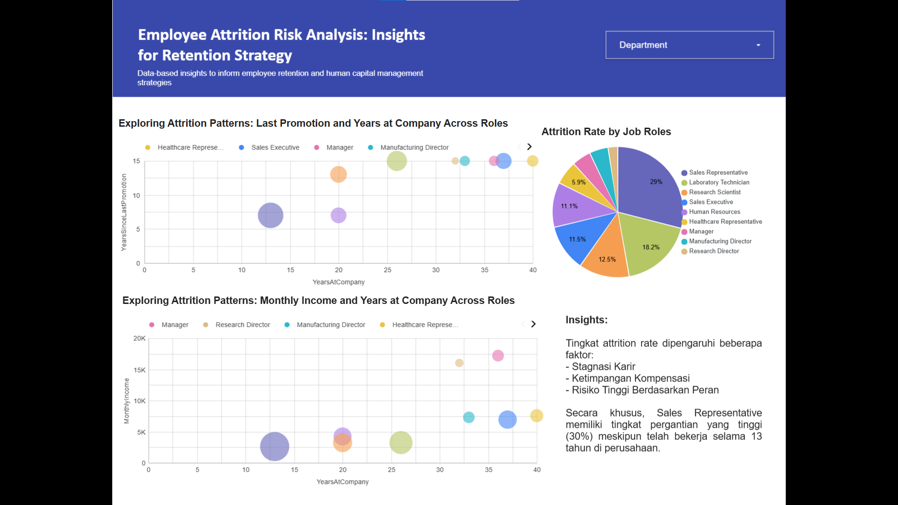

# Proyek Akhir: Menyelesaikan Permasalahan Perusahaan Edutech

## Business Understanding

Jaya Jaya Maju adalah perusahaan multinasional yang telah berdiri sejak tahun 2000 dan memiliki lebih dari 1000 karyawan yang tersebar di seluruh penjuru negeri. Meskipun telah berkembang menjadi perusahaan besar, Jaya Jaya Maju masih menghadapi tantangan dalam mengelola karyawannya.
Kesulitan dalam manajemen ini berimbas pada tingginya attrition rate yang mencapai lebih dari 10%. Oleh karena itu, perusahaan membutuhkan solusi untuk mengidentifikasi faktor-faktor yang mempengaruhi attrition rate agar dapat mempertahankan tenaga kerja yang berkualitas dan mengurangi kehilangan karyawan.

### Permasalahan Bisnis

Bisnis Jaya Jaya Maju ini mengalami attrition rate diatas 10%

### Cakupan Proyek

Proyek ini bertujuan untuk:

1.  Melakukan eksplorasi dan analisis data karyawan untuk mengidentifikasi faktor-faktor yang berkontribusi terhadap attrition.
2.  Membangun model klasifikasi untuk memprediksi kemungkinan karyawan keluar (attrition).
3.  Memberikan rekomendasi strategi kepada perusahaan untuk mengurangi attrition rate dan meningkatkan retensi karyawan.

### Persiapan

Sumber data: https://github.com/dicodingacademy/dicoding_dataset/blob/f4a7541bc3dfca0012e20778e135c03b3e76dc67/employee/employee_data.csv

Setup environment:

```
!pip install --upgrade scikit-learn
import pandas as pd
import numpy as np
from scipy.stats.mstats import winsorize
from sklearn.model_selection import train_test_split
from sklearn.preprocessing import StandardScaler, LabelEncoder
from sklearn.linear_model import LogisticRegression
from sklearn.metrics import classification_report, confusion_matrix, roc_auc_score
from imblearn.over_sampling import SMOTE
import matplotlib.pyplot as plt
import seaborn as sns

import warnings
warnings.filterwarnings('ignore')

```

## Business Dashboard

Link Akses: https://lookerstudio.google.com/reporting/1c303a6c-3232-4a0f-b9fc-13ee80d55bcd





Dashboard ini memberikan visualisasi interaktif dari data karyawan untuk membantu memahami faktor-faktor yang mempengaruhi attrition.
Berikut adalah penjelasan lebih mendalam mengenai dashboard analisis attrition:

1. Distribusi Attrition

   **Deskripsi Visualisasi:**

   Dashboard ini menyajikan pie chart yang membagi populasi karyawan menjadi dua kategori utama yaitu **Tetap Bekerja** dan **Attrition**
   Tujuan dan Interpretasi:

   Pie chart memberikan gambaran cepat tentang seberapa besar porsi karyawan yang memilih untuk keluar dibandingkan dengan yang bertahan. Misalnya, jika chart menunjukkan angka attrition sebesar 12%, artinya dari setiap 100 karyawan, 12 karyawan telah memutuskan untuk meninggalkan perusahaan. Visualisasi ini akan membantu dalam melihat secara langsung seberapa serius masalah retensi yang sedang dihadapi, karena angka proporsional ini cukup untuk menunjukkan adanya potensi isu dalam manajemen SDM.

   **Implikasi Bisnis:**

   - Identifikasi Masalah: Angka attrition yang tinggi bisa menandakan adanya masalah pada lingkungan kerja, budaya perusahaan, atau mekanisme pengembangan karier yang mungkin belum optimal.

   - Tindak Lanjut Strategis: Data ini menjadi dasar dalam menetapkan target pengurangan attrition melalui program-program retensi seperti peningkatan kesejahteraan, pelatihan keterampilan, atau peninjauan kompensasi.

   - Komunikasi yang Efektif: Dengan angka persentase yang jelas, manajemen dan tim HR dapat menyampaikan situasi secara transparan kepada pemangku kepentingan, sehingga langkah-langkah intervensi yang terstruktur dapat segera diterapkan.

2. Perbandingan Monthly Income

   Visualisasi yang Digunakan:

   Dashboard menggunakan boxplot dan histogram untuk menganalisis data pendapatan bulanan (Monthly Income).

   **A. Boxplot**

   - Tujuan: Menyajikan perbandingan statistik antara karyawan yang tetap bekerja dan yang mengalami attrition.

   - Interpretasi:
     Median, Kuartil, dan Rentang: Boxplot membantu mengidentifikasi apakah karyawan yang mengundurkan diri umumnya memiliki pendapatan yang lebih rendah dibandingkan dengan mereka yang bertahan.

   - Outlier: Kehadiran nilai ekstrim (outlier) dalam kedua kelompok menunjukkan adanya variasi signifikan dalam kompensasi, yang bisa menjadi indikasi ketidakadilan atau disparitas yang perlu diperhatikan.

   **B. Histogram**

   - Tujuan: Menampilkan distribusi frekuensi karyawan berdasarkan rentang pendapatan.

   - Interpretasi:
     Pola Frekuensi: Histogram memudahkan identifikasi rentang pendapatan di mana konsentrasi attrition lebih tinggi. Misalnya, apabila terlihat bahwa sebagian besar karyawan dengan pendapatan pada rentang tertentu cenderung keluar, ini memberi sinyal bahwa struktur gaji di level tersebut mungkin kurang kompetitif.

   **Implikasi Bisnis:**

   - Evaluasi Kebijakan Kompensasi: Jika data menunjukkan korelasi antara pendapatan yang lebih rendah dan kecenderungan attrition, perusahaan dapat menyesuaikan struktur gaji atau menambahkan benefit/insentif untuk meningkatkan loyalitas.

   - Segmentasi Strategis: Memahami distribusi pendapatan memungkinkan perusahaan untuk menargetkan intervensi pada segmen yang paling rentan, sehingga strategi retensi dapat dirancang dengan lebih spesifik dan terukur.

3. Work-Life Balance dan Job Satisfaction vs. Attrition

   Dashboard menggunakan countplot untuk melihat hubungan antara variabel subjektif seperti Work-Life Balance dan Job Satisfaction dengan status attrition.

   **Tujuan dan Interpretasi:**

   - Analisis Kategori: Countplot membagi karyawan ke dalam kategori-kategori nilai (misalnya, skala 1 hingga 4) berdasarkan tingkat Work-Life Balance dan Job Satisfaction.
   - Relasi dengan Attrition: Dengan membandingkan jumlah karyawan yang keluar versus yang bertahan di setiap kategori, dashboard membantu mengidentifikasi apakah karyawan dengan nilai rendah pada kedua variabel tersebut lebih rentan terhadap attrition.
   - Insight Visual: Pola yang muncul misalnya menunjukkan bahwa karyawan dengan kepuasan kerja atau keseimbangan hidup-kerja yang rendah cenderung memiliki tingkat attrition yang lebih tinggi, sehingga menjadi area yang mendesak untuk perbaikan.

   **Implikasi Bisnis:**

   - Peningkatan Kebijakan Internal: Temuan ini mendukung inisiasi program peningkatan kesejahteraan karyawan, seperti fleksibilitas kerja, dukungan kesehatan mental, atau program penghargaan dan feedback yang efektif.
   - Prioritas Intervensi: Dengan melihat mana kategori yang paling bermasalah, manajemen dapat memprioritaskan alokasi sumber daya untuk meningkatkan aspek-aspek kritis tersebut, yang pada akhirnya dapat menurunkan angka attrition secara signifikan.

## Conclusion

Dashboard analisis attrition ini memberikan gambaran mendalam mengenai faktor-faktor kunci yang mempengaruhi keputusan karyawan untuk meninggalkan perusahaan.

Secara kuantitatif, pie chart menunjukkan tingkat attrition yang signifikan, misalnya 12% karyawan yang keluar dari total karyawan. Data yang divisualisasikan melalui boxplot dan histogram mengungkapkan perbedaan signifikan dalam pendapatan antara karyawan yang bertahan dan yang keluar, menunjukkan potensi hubungan antara kompensasi yang rendah dan risiko attrition. Selain itu, countplot yang mengaitkan Work-Life Balance dan Job Satisfaction dengan attrition mengungkapkan bahwa karyawan yang memiliki kepuasan kerja serta keseimbangan hidup-kerja yang rendah cenderung memiliki tingkat attrition yang lebih tinggi.

Kombinasi temuan tersebut menyoroti bahwa selain faktor finansial, aspek pengembangan jalur karir, kesejahteraan, dan mekanisme feedback internal juga memainkan peran penting dalam retensi karyawan. Dengan demikian, dashboard ini menyediakan dasar yang kuat bagi manajemen untuk merancang strategi retensi berbasis data dan intervensi yang terfokus.

Berdasarkan analisis data dan pemodelan, beberapa kesimpulan utama adalah:

1. Attrition rate dalam dataset adalah 12.18%.
2. Faktor-faktor seperti Monthly Income, Work-Life Balance, dan Job Satisfaction signifikan mempengaruhi keputusan karyawan untuk keluar.
3. Model Logistic Regression yang dibangun memiliki ROC AUC sebesar 0.784, menunjukkan kemampuan yang cukup baik dalam memprediksi attrition, tetapi masih bisa dioptimalkan.
4. Overtime dan Performance Rating juga teridentifikasi sebagai faktor penting dalam analisis attrition.

### Rekomendasi Action Items

Berdasarkan analisis terbaru, berikut adalah beberapa rekomendasi tindakan yang dapat diimplementasikan:

1. Pengembangan Jalur Karir dan Keterampilan

- Rancang program pengembangan karir: Implementasikan jalur karir yang jelas dan transparan, termasuk program mentoring serta pelatihan yang sesuai dengan kebutuhan karyawan.
- Fokus pada talenta internal: Identifikasi karyawan berpotensi tinggi untuk program suksesi dan promosi dari dalam, sehingga mengurangi rasa stagnasi dan meningkatkan loyalitas.

2. Peninjauan dan Penyempurnaan Kebijakan Kompensasi

- Evaluasi struktur gaji: Lakukan benchmark dengan industri untuk memastikan struktur kompensasi yang kompetitif. Pertimbangkan penyesuaian serta benefit tambahan bagi karyawan di level pendapatan rendah.
- Skema penyesuaian gaji: Kembangkan rencana kenaikan gaji atau bonus berbasis kinerja untuk memotivasi karyawan dan mengurangi ketimpangan kompensasi.

3. Inisiatif Work-Life Balance

- Fleksibilitas kerja: Kembangkan kebijakan kerja fleksibel, seperti pengaturan remote atau sistem kerja hybrid, guna mendukung keseimbangan antara kehidupan pribadi dan profesional.
- Program kesejahteraan: Implementasikan program kesehatan mental, konseling, serta dukungan kesejahteraan secara rutin untuk menciptakan lingkungan kerja yang suportif.

4. Mekanisme Umpan Balik dan Pengawasan Berkala

- Survei dan feedback reguler: Bangun sistem survei serta forum komunikasi dua arah (misalnya pertemuan rutin ataupun platform digital) agar karyawan dapat menyampaikan umpan balik secara terbuka.
- Monitoring berkelanjutan: Gunakan dashboard dan data analitik secara berkala untuk memonitor tren attrition dan efektivitas inisiatif retensi. Lakukan penyesuaian strategis berdasarkan data terbaru.

5. Pendekatan Data-Driven untuk Optimalisasi Sumber Daya Manusia

- Segmentasi karyawan: Lakukan analisis segmentasi berbasis departemen atau jabatan untuk menemukan area manajemen SDM yang paling memerlukan intervensi spesifik.
- Analisis lanjutan: Pertimbangkan penggunaan analisis regresi atau time series guna mengeksplorasi faktor-faktor penyebab attrition secara lebih mendalam serta memprediksi tren di masa mendatang.
